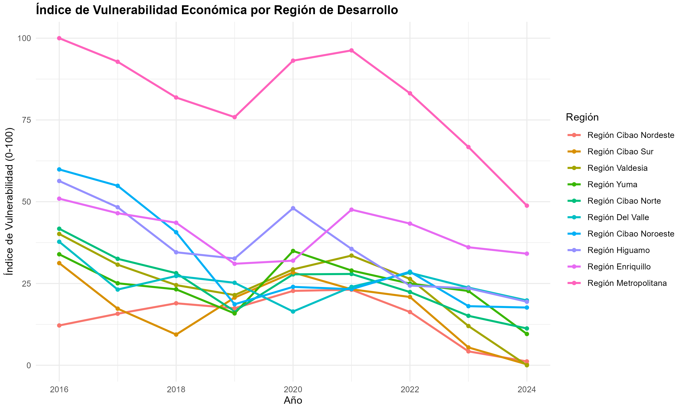

# Proyecto: Vulnerabilidad Económica Territorial en la República Dominicana (2016–2024)


Este repositorio contiene un análisis aplicado sobre la vulnerabilidad económica a nivel de regiones de desarrollo en la República Dominicana.
El proyecto integra información oficial proveniente del MEPyD, ONE y otras fuentes públicas, con técnicas de limpieza, transformación y análisis de datos en R.

El objetivo central es construir un índice territorial de vulnerabilidad económica, utilizando variables robustas y comparables en el tiempo —principalmente pobreza monetaria y población—, y acompañarlo de un análisis descriptivo del contexto económico y laboral del país.
---

## Objetivos del proyecto

- Integrar en un solo panel datos oficiales de pobreza y población para el período 2016–2024.

- Construir la primera versión de un índice de vulnerabilidad económica por región de desarrollo.

- Analizar y comparar la evolución de pobreza y estructura poblacional entre regiones.

- Generar visualizaciones, tablas y un reporte técnico que sirva como insumo para el diseño de políticas públicas orientadas al territorio.

---

## Estructura del repositorio

La estructura general del proyecto es la siguiente:

```text
vulnerabilidad-economica-rd/
│
├── data/
│   ├── raw/         # Datos originales descargados de las fuentes oficiales
│   └── processed/   # Datos limpios y listos para análisis
│
├── src/
│   ├── 01_limpieza_de_datos.R  # Limpieza, transformación y unificación de bases
│   └── 02_analysis.R   # Análisis descriptivo, índices y modelos
│
├── output/
│   ├── figuras/     # Gráficos finales (PNG, JPG) para el reporte y README
│   └── tablas/      # Tablas exportadas en CSV/XLSX
│
└── docs/
    ├── reporte.qmd  # Reporte técnico en Quarto
    └── reporte.html # Versión renderizada del reporte (HTML/PDF)
    
```
## Metodologia

1. Recolección y unificación de datos

Importación de tabulados oficiales del MEPyD (pobreza monetaria).

Importación de tabulados de población de la ONE.

Estandarización de nombres de regiones de desarrollo.

Integración en un panel unificado:
región de desarrollo × año (2016–2024).

2. Limpieza y transformación

Manejo de encabezados múltiples en Excel.

Conversión de porcentajes a proporciones.

Construcción de variables derivadas, como:

población en pobreza (tasa × población),

diferencias interanuales,

rankings regionales.

3.Índice de Vulnerabilidad Territorial – Versión 1

Variables utilizadas:

- Tasa de pobreza monetaria.

- Población total.

Tratamiento técnico:

Normalización mediante z-score.

Construcción de un índice aditivo simple (versión inicial).

Comparación temporal y entre regiones.

Posibles mejoras futuras:

brecha y severidad de la pobreza,

indicadores educativos,

variables laborales subnacionales,

PCA u otros métodos de agregación más robustos.


4. Análisis y visualización

Evolución de la pobreza por región de desarrollo.

Comparación del nivel de vulnerabilidad entre regiones.

Gráficos de distribución y rankings.

Análisis contextual del mercado laboral nacional (2014–2025).

## A futuro
Próximas extensiones

Incorporar brecha y severidad de la pobreza por región de desarrollo.

Integrar indicadores educativos y de mercado laboral si se publican a nivel subnacional.

Construir una versión multidimensional del índice con PCA o ponderaciones.

Explorar tipologías territoriales (clustering) cuando existan más variables.
